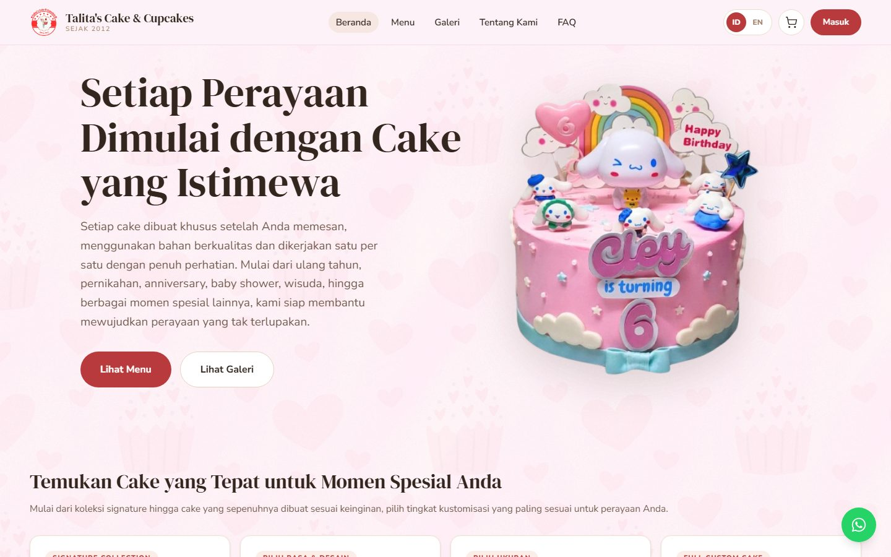

# Talita's Cake & Cupcakes

Situs toko kue rumahan di Depok: katalog produk, keranjang, dan checkout yang
berakhir di WhatsApp — bukan pembayaran online. Dilengkapi panel admin untuk
mengelola produk, galeri, pesanan, dan statistik pengunjung.

🔗 **Kunjungi situsnya:** [talita-cakes.vercel.app](https://talita-cakes.vercel.app)



Repositori ini berisi dua aplikasi yang berjalan terpisah:

| Folder      | Isi                    | Dijalankan di   |
| ----------- | ---------------------- | --------------- |
| `backend/`  | REST API + basis data  | Render          |
| `frontend/` | Situs & panel admin    | Vercel          |

---

## Cara kerja singkat

**Pemesanan berakhir di WhatsApp.** Pembeli menyusun pesanan di situs, lalu
menekan konfirmasi. Pesanan disimpan sebagai catatan, dan pembeli diarahkan ke
chat penjual dengan pesan yang sudah tersusun rapi berisi rincian pesanan,
tanggal, alamat, dan totalnya. Kesepakatan akhir terjadi di chat itu.

**Halaman dibangun jadi HTML saat build.** Halaman publik di-render lebih dulu
sewaktu proses build, jadi mesin pencari menerima halaman yang sudah berisi —
bukan halaman kosong yang menunggu JavaScript. Setelah terbuka di peramban,
aplikasi mengambil alih dan berpindah halaman tanpa memuat ulang.

Konsekuensinya: mengubah produk atau galeri lewat panel admin **tidak langsung
terlihat di HTML statis**. Backend memicu build ulang otomatis lewat
`DEPLOY_HOOK_URL` (lihat [Deploy](#deploy)). Bagi pengunjung biasa perubahannya
tetap langsung terlihat, karena data diambil dari API.

**Ongkir dihitung server.** Jarak dihitung dari koordinat alamat memakai rute
motor lewat HERE Routing API, dengan jarak garis lurus sebagai cadangan kalau
layanan itu tidak tersedia. Angka dari peramban tidak pernah dipercaya.

---

## Menjalankan di komputer sendiri

Butuh Node.js 20+ (dikembangkan memakai v24) dan sebuah basis data PostgreSQL.

### Backend

```bash
cd backend
npm install
cp .env.example .env        # lalu isi nilainya, lihat tabel di bawah
npx prisma migrate dev      # siapkan tabel basis data
npx prisma db seed          # buat akun admin pertama (butuh ADMIN_* di .env)
npm run dev                 # jalan di http://localhost:5000
```

Panel admin di `/admin` hanya bisa dibuka akun ber-peran admin, dan peran itu
tidak bisa diberikan lewat halaman pendaftaran. Karena itu akun admin pertama
dibuat lewat perintah seed di atas. Perintahnya aman diulang: akun yang sudah
ada diperbarui, bukan diduplikasi.

### Frontend

```bash
cd frontend
npm install
cp .env.example .env        # isi minimal VITE_API_BASE_URL
npm run dev                 # jalan di http://localhost:5173
```

Isi `VITE_API_BASE_URL` dengan `http://localhost:5000/api` saat mengembangkan.

### Perintah lain

| Perintah                | Folder     | Kegunaan                                        |
| ----------------------- | ---------- | ----------------------------------------------- |
| `npm run dev`           | keduanya   | jalankan mode pengembangan                      |
| `npm start`             | backend    | jalankan mode produksi                          |
| `npm run build`         | backend    | siapkan Prisma & terapkan migrasi (dipakai Render) |
| `npm run build`         | frontend   | build lengkap: HTML statis + sitemap + robots.txt |
| `npm run build:spa`     | frontend   | build tanpa pra-render, untuk memeriksa cepat   |
| `npm run preview`       | frontend   | lihat hasil build secara lokal                  |
| `npx prisma db seed`    | backend    | buat/perbarui akun admin dari `ADMIN_*`         |
| `npx prisma studio`     | backend    | lihat & sunting isi basis data lewat peramban   |

---

## Pengaturan (environment variable)

### Backend

| Nama                       | Wajib | Keterangan                                                        |
| -------------------------- | :---: | ----------------------------------------------------------------- |
| `DATABASE_URL`             |  ya   | Koneksi PostgreSQL. Pakai yang *pooled* untuk aplikasi.           |
| `JWT_SECRET`               |  ya   | Kunci penanda access token. Isi teks acak yang panjang.           |
| `JWT_REFRESH_SECRET`       |  ya   | Kunci refresh token. **Harus berbeda** dari yang di atas.         |
| `FRONTEND_URL`             |  ya   | Alamat frontend, untuk izin akses lintas domain & cookie.         |
| `NODE_ENV`                 |       | Isi `production` saat dideploy. Kosongkan saat lokal.             |
| `PORT`                     |       | Default 5000. Di Render diisi otomatis.                           |
| `ADMIN_NAME`               |       | Keempatnya dipakai `npx prisma db seed` untuk membuat akun admin pertama. Tidak lengkap = pembuatan admin dilewati. |
| `ADMIN_EMAIL`              |       |                                                                   |
| `ADMIN_PASSWORD`           |       |                                                                   |
| `ADMIN_PHONE`              |       |                                                                   |
| `CLOUDINARY_CLOUD_NAME`    |  ya   | Penyimpanan gambar. Server ini tidak menyimpan berkas apa pun.    |
| `CLOUDINARY_API_KEY`       |  ya   |                                                                   |
| `CLOUDINARY_API_SECRET`    |  ya   |                                                                   |
| `RESEND_API_KEY`           |  ya   | Pengiriman email kode OTP.                                        |
| `RESEND_FROM_EMAIL`        |  ya   | Alamat pengirim, mis. `Talita Cakes <no-reply@domain.com>`.       |
| `EMAIL_LOGO_URL`           |       | Logo di email. Kosong = pakai `logo.png` dari frontend.           |
| `OWNER_WHATSAPP_NUMBER`    |  ya   | Tujuan pesanan. Format internasional **tanpa** `+`.               |
| `STORE_LATITUDE`           |  ya   | Titik toko, jadi acuan perhitungan ongkir.                        |
| `STORE_LONGITUDE`          |  ya   |                                                                   |
| `HERE_API_KEY`             |       | Jarak rute motor. Kosong = pakai jarak garis lurus (lebih murah dari jarak sebenarnya). |
| `GOOGLE_MAPS_API_KEY`      |       | Ulasan Google. Lihat catatan di bawah.                            |
| `GOOGLE_PLACE_ID`          |       |                                                                   |
| `VISITOR_ID_SALT`          |       | Pengacak penanda pengunjung cadangan.                             |
| `DEPLOY_HOOK_URL`          |       | Pemicu build ulang otomatis. Kosong = fitur mati.                 |
| `DEPLOY_HOOK_DEBOUNCE_MS`  |       | Jeda pemicu, default 2 menit.                                     |

### Frontend

| Nama                        | Wajib | Keterangan                                                     |
| --------------------------- | :---: | -------------------------------------------------------------- |
| `VITE_API_BASE_URL`         |  ya   | Alamat backend + `/api`.                                       |
| `VITE_SITE_URL`             |       | Alamat situs, tanpa garis miring di akhir. Kosong = penunjuk alamat resmi tidak dipasang. |
| `VITE_MAPTILER_KEY`         |       | Peta checkout. Kosong = pakai peta tanpa kunci.                |
| `VITE_OWNER_WHATSAPP_NUMBER`|       | Ditampilkan di footer & tombol melayang.                       |
| `VITE_OWNER_INSTAGRAM`      |       | Nama pengguna tanpa `@`. Kosong = ikonnya tidak muncul.        |
| `VITE_OWNER_THREADS`        |       | Sama seperti di atas.                                          |
| `VITE_OWNER_TIKTOK`         |       | Sama seperti di atas.                                          |
| `VITE_STORE_ADDRESS`        |       | Alamat toko di footer.                                         |
| `VITE_HALAL_CERT_NUMBER`    |       | Nomor sertifikat halal. Sudah ada nilai bawaannya.             |

> Tabel di atas disusun dari variabel yang benar-benar dibaca kode, dan
> `.env.example` di kedua folder sudah dicocokkan dengannya. Kalau menambah
> variabel baru, tambahkan juga ke berkas contoh agar keduanya tidak melenceng.

---

## Susunan folder

### Backend

Tiap fitur berdiri sendiri di `src/features/<nama>/`, dengan pembagian lapisan
yang sama di semua fitur:

```
routes       daftar alamat endpoint + middleware yang dipasang
validation   memeriksa bentuk data yang masuk (memakai Zod)
controller   urusan HTTP saja: baca request, panggil service, susun jawaban
service      aturan bisnis — di sinilah keputusan diambil
repository   satu-satunya yang menyentuh basis data
```

```
backend/src/
├─ features/     auth, product, cart, order, gallery, analytics,
│                review, settings, upload
├─ middlewares/  penjaga login & peran, validasi, penangan error
├─ lib/          koneksi Prisma, penyimpanan sementara
├─ utils/        token, OTP, email, jarak, penyusun pesan WhatsApp
├─ config/       .env, identitas toko, versi ketentuan layanan
└─ routes/       titik kumpul seluruh endpoint (prefix /api)
```

Endpoint yang tersedia: `/auth`, `/products`, `/carts`, `/orders`,
`/galleries`, `/analytics`, `/uploads`, `/reviews`, `/settings`.

### Frontend

```
frontend/src/
├─ views/        halaman, termasuk views/admin/ dan views/auth/
├─ components/   admin/ · checkout/ · common/ · product/
├─ stores/       keadaan bersama (Pinia): sesi, keranjang, katalog, dsb.
├─ services/     pemanggilan API
├─ config/       aturan produk, identitas toko, perkakas SEO
├─ locales/      teks dua bahasa (id & en)
├─ lib/          klien API, penanda pengunjung
├─ router/       daftar halaman + penjaga akses
└─ utils/        format rupiah, pencarian alamat, gambar
```

---

## Hal yang perlu diketahui

**Enam tipe produk.** Ini sumber kerumitan terbesar di proyek ini, karena tiap
tipe punya cara memilih yang berbeda:

| Tipe  | Yang dipilih pembeli                                            |
| ----- | --------------------------------------------------------------- |
| TYPE1 | tidak ada — bentuk, ukuran, dan rasa sudah ditetapkan            |
| TYPE2 | rasa + acuan desain                                              |
| TYPE3 | bentuk & ukuran                                                  |
| TYPE4 | bentuk, ukuran, rasa, + acuan desain                             |
| TYPE5 | tergantung kategori: ukuran bernama (roti), pilihan ukuran (Basque), filling & topping (Cinrolls), atau tidak ada |
| TYPE6 | isi box + rasa; goodiebag dijual per paket dengan pembelian minimal |

Aturannya ditulis di **dua tempat yang harus selalu sama**:
`backend/src/features/product/product.constant.js` dan
`frontend/src/config/productOptions.js`. Menambah kategori atau rasa berarti
menyunting keduanya — kalau hanya salah satu, admin bisa memilih sesuatu yang
lalu ditolak server.

**Harga selalu dihitung ulang server.** Angka dari peramban tidak pernah
dipercaya, baik harga produk maupun ongkir.

**Dua macam token.** Access token berumur 1 jam dan hanya disimpan di memori
peramban. Refresh token berumur 7 hari, disimpan di cookie yang tidak bisa
dibaca JavaScript. Karena itu memuat ulang halaman memicu pemulihan sesi
otomatis. Ketiga angka masa berlaku itu harus sejalan: `utils/token.js`,
`auth.service.js`, dan `utils/cookie.js`.

**Pemesanan minimal H+3.** Diatur lewat `MIN_DAYS_BEFORE_CAKE_DATE` di
`backend/src/features/order/order.helper.js`.

**Teks situs dwibahasa.** Semua teks ada di `frontend/src/locales/`. Kunci di
`id.js` dan `en.js` harus sama persis. Khusus halaman "Tentang Kami", teksnya
dipisah ke `locales/id/about.js` yang sengaja diberi panduan agar bisa disunting
pemilik toko tanpa perlu paham koding.

---

## Deploy

Frontend ditayangkan sebagai kumpulan berkas HTML statis, backend sebagai
aplikasi Node biasa.

### 1. Build frontend

**Backend harus hidup dan terjangkau selama build berlangsung.** Saat halaman
di-render jadi HTML, ia mengambil data lewat `VITE_API_BASE_URL` — daftar produk
untuk halaman `/product/:id`, serta isi Menu, Home, dan Galeri. Kalau API mati,
build tetap berhasil tapi hanya halaman statis yang jadi; halaman produk
terpaksa dirender di peramban dan tidak terbaca mesin pencari.

Isi environment variable di penyedia hosting frontend, minimal:

- `VITE_API_BASE_URL` — alamat backend + `/api`
- `VITE_SITE_URL` — domain situs tanpa garis miring di akhir. Wajib diisi kalau
  SEO diharapkan bekerja, karena dipakai penunjuk alamat resmi, pratinjau
  tautan, dan `sitemap.xml`.

```bash
cd frontend
npm ci
npm run build     # menghasilkan frontend/dist/ berisi HTML, aset,
                  # sitemap.xml, dan robots.txt
```

### 2. Fallback ke index.html (wajib)

Halaman yang **tidak** ikut dibangun jadi HTML — `/cart`, `/checkout`,
`/profile`, `/admin/*`, halaman akun, serta produk baru yang belum sempat
di-build ulang — harus dialihkan ke `index.html` agar dirender di peramban.
Halaman yang sudah punya berkas HTML tetap disajikan dari berkasnya, karena
penyedia hosting memeriksa keberadaan berkas lebih dulu.

Konfigurasinya sudah disiapkan di repo:

- **Netlify / Cloudflare Pages** — `frontend/public/_redirects`, otomatis ikut
  tersalin ke `dist/`.
- **Vercel** — `frontend/vercel.json`. Root Directory proyek harus disetel ke
  `frontend`.
- **Render (Static Site)** — tambahkan aturan di dashboard:
  `Source: /*` → `Destination: /index.html`, Action: Rewrite.
- **Nginx**:
  ```nginx
  location / { try_files $uri $uri.html $uri/index.html /index.html; }
  ```

> **Jangan mengubah tujuan rewrite Vercel menjadi `/index.html`.**
> Ini pernah membuat situs 404 di produksi. Dengan `cleanUrls` aktif,
> `/index.html` sudah menjadi aturan pengalihan 308 ke `/`, sedangkan rewrite
> tidak mengikuti pengalihan — akibatnya semua halaman yang tidak dibangun jadi
> HTML berbalik menjadi 404. Tujuannya harus `/`.

### 3. Build ulang otomatis saat konten berubah

Karena halaman dibangun saat build, konten baru baru masuk ke HTML setelah
build ulang. Ini hanya berpengaruh pada mesin pencari — pengunjung biasa
langsung melihat perubahannya.

1. Buat **Deploy Hook** di penyedia hosting frontend (alamat rahasia yang
   memicu build ulang). Netlify: Site settings → Build & deploy → Build hooks.
   Vercel: Settings → Git → Deploy Hooks. Cloudflare Pages dan Render punya
   fitur serupa.
2. Isi environment variable di **backend**:
   - `DEPLOY_HOOK_URL` — alamat hook tadi
   - `DEPLOY_HOOK_DEBOUNCE_MS` — opsional, default 2 menit
3. Backend memanggil hook itu setiap produk atau galeri berubah, dengan jeda
   supaya banyak perubahan beruntun hanya memicu satu build.

Kalau `DEPLOY_HOOK_URL` dikosongkan, fitur ini mati — aman untuk pengembangan
lokal.

### 4. Memeriksa hasilnya

- Buka "View Page Source" pada `/` dan `/product/<id>`. HTML-nya harus sudah
  berisi nama, deskripsi, dan harga produk — bukan halaman kosong.
- Pastikan `/sitemap.xml` dan `/robots.txt` bisa dibuka.
- Uji data terstruktur lewat Google Rich Results Test, lalu daftarkan sitemap
  di Search Console.
- Tempel tautan produk di WhatsApp — pratinjaunya (judul + gambar) harus muncul.

---

## Yang belum rapi

Beberapa hal yang diketahui belum beres, dicatat agar tidak menyesatkan:

1. **Fitur ulasan Google menganggur.** Backend punya rantai lengkapnya —
   endpoint, penyimpanan sementara 6 jam, kunci API — tapi
   `components/common/GoogleReviews.vue` memakai ulasan yang ditulis langsung
   di dalam berkasnya. `services/review.service.js` tidak dipanggil komponen
   mana pun. Perlu diputuskan: disambungkan, atau kode backend-nya dibuang.

2. **Komentar keliru** di `backend/src/features/product/product.service.js`
   menyebut "Mozzarella Sausage Rolls" sebagai contoh kategori tanpa
   sub-kategori, padahal ia justru sebuah sub-kategori dari Bread.

---

## Teknologi

**Backend** — Node.js, Express 5, Prisma 7 (PostgreSQL), Zod, JWT, bcrypt,
Cloudinary, Resend.

**Frontend** — Vue 3, Vite 8, vite-ssg, Pinia, Vue Router, Vue I18n,
Tailwind CSS 4, Axios, MapLibre GL.
